<p align="center">
  
</p>

<h1 align="center">ARTHIX</h1>

<p align="center">
  <strong>AI-Powered Hyper-Personalized Banking for Bharat</strong>
</p>

<p align="center">
  <em>The right product. The right moment. Or no product at all.</em>
</p>

<p align="center">
  ARTHIX does not just personalize banking.<br />
  It personalizes the decision of whether banking should sell anything at all.
</p>

<p align="center">
  
  
  
  
  
  
  
  
  
</p>

<p align="center">
  <a href="#financial-wellbeing-first-products-second">Philosophy</a> ·
  <a href="#vivek">Vivek</a> ·
  <a href="#product-interface">Interface</a> ·
  <a href="#5-minute-arthix-demo">Demo</a> ·
  <a href="#quick-start">Quick Start</a> ·
  <a href="#current-limitations">Limitations</a>
</p>

<p align="center">
  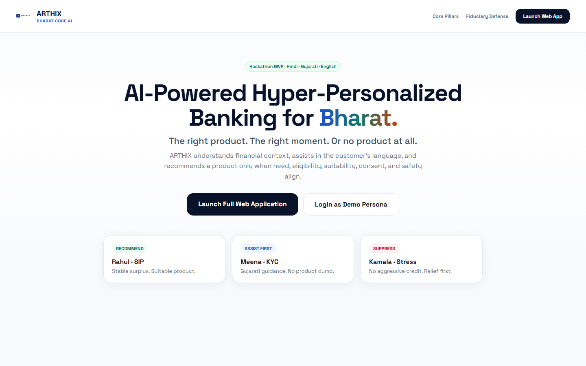
</p>

<p align="center"><sub>Landing · Recommend / Assist First / Suppress in one glance</sub></p>

---

> **Prototype honesty.** ARTHIX is a hackathon prototype. It does not claim RBI compliance or DPDP certification. Production deployment would require formal legal, regulatory, security, privacy, and model-risk validation.
>
> Banking rails in this repository — CBS, UPI, CKYC, bureau, OTP, DigiLocker, Google sign-in — are **mocked demo adapters**, not live integrations.

---

## What ARTHIX is

ARTHIX is an **AI-powered hyper-personalized banking intelligence layer** designed for Bharat.

It is **not a new bank**. It is **not a chatbot with product banners**.

Indian digital rails are strong. Bharat experiences are not. Banks already hold rich transactional ledgers, yet the same generic offer can reach a first-time Gujarati user, a salaried Tier-2 professional, and a household already missing an EMI.

ARTHIX sits on top of existing banking journeys and uses **consented financial context** to:

- understand income cadence, spending mix, EMI load, and surplus
- assist customers in **Hindi, Gujarati, and English**
- detect financial stress and unusual activity
- recommend a product **only** when need, eligibility, suitability, timing, consent, and safety align
- **suppress** credit when the responsible action is to show nothing

The spine of the product is **Vivek**: Recommend, Assist First, or Suppress.

```text
Understand  →  Personalize  →  Assist  →  Protect  →  Recommend only if safe
```

---

## Why ARTHIX exists

Banks already have UPI, net banking, mobile apps, and video KYC. A large share of customers in Tier 2 / 3 / 4 towns and rural India still find those apps confusing, generic, and disconnected from actual financial life.

Three failures follow:

| Failure | What happens today |
| --- | --- |
| **Relevance** | A salary step-up and a missed EMI receive the same pop-up. |
| **Access** | English-first copy and jargon cause first-time users to abandon KYC. |
| **Conduct** | Stress and fraud are often treated punitively. Customers hide or lose trust. |

Typical stacks already include generic banners, rule-based campaigns, FAQ chatbots, a separate fraud engine, and collections after delinquency. They do not share one financial profile. They have **no obligation to not sell**. Ethics usually sits in a policy PDF, not in a runtime gate.

A vernacular chatbot alone does not solve this. Personalization that always shows a product does not solve this either.

---

## Financial wellbeing first. Products second.

Traditional banking personalization asks:

> **“What can we sell this customer?”**

ARTHIX asks:

> **“What does this customer actually need right now?”**

That question has three honest answers.

<table>
  <tr>
    <td width="33%" valign="top">

### RECOMMEND

A suitable product genuinely fits the customer's financial context.

Need, eligibility, suitability, timing, consent, and safety all pass.

    </td>
    <td width="33%" valign="top">

### ASSIST FIRST

The customer needs help before they need another product.

KYC friction, thin emergency buffer, or financial stress.

    </td>
    <td width="33%" valign="top">

### SUPPRESS

The responsible action is to show nothing.

No genuine need. Missing consent. High leverage. Harmful credit.

    </td>
  </tr>
</table>

A marketing propensity score **cannot** override stress, leverage, consent, suitability, or eligibility.

> Personalization that cannot say no is just aggressive selling.

---

<a id="vivek"></a>

## Vivek — The Responsible Decision Engine

**Vivek is deterministic decision intelligence, not a black-box neural network.**

It receives candidates from JeevanChakra. It does not invent products. It decides whether a candidate is allowed to appear.

Implemented gates in `lib/services/vivek.ts`:

| Order | Gate | If it fails |
| --- | --- | --- |
| 1 | Purpose-level personalization consent | **SUPPRESS** |
| 2 | High financial stress / missed EMI / deficit | **ASSIST FIRST** and suppress aggressive credit |
| 3 | Over-leverage (DTI above the 35% safety line) | **SUPPRESS** credit |
| 4 | Emergency buffer under 3.0 months of essentials | **ASSIST FIRST** — build reserve before equity |
| 5 | Need + eligibility + suitability + surplus stability | **RECOMMEND** |
| — | Otherwise | **ASSIST FIRST** (fiduciary review) |

A fourth action, **VERIFY**, is used by Kavach when a transaction looks unusual. Vivek does not silently freeze accounts.

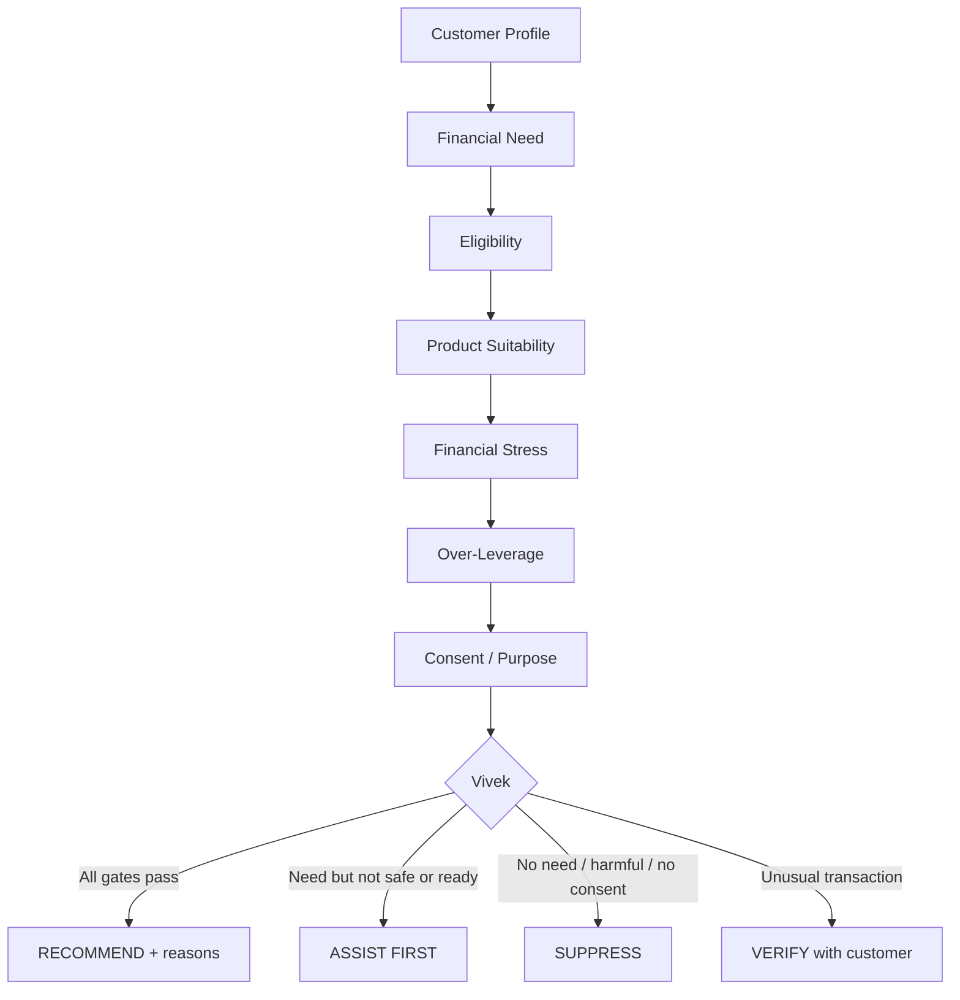
```mermaid
flowchart TB
  CP[Customer Profile]
  CP --> FN[Financial Need]
  FN --> EL[Eligibility]
  EL --> SU[Product Suitability]
  SU --> ST[Financial Stress]
  ST --> OL[Over-Leverage]
  OL --> CN[Consent / Purpose]
  CN --> V{Vivek}
  V -->|All gates pass| R[RECOMMEND + reasons]
  V -->|Need but not safe or ready| A[ASSIST FIRST]
  V -->|No need / harmful / no consent| S[SUPPRESS]
  V -->|Unusual transaction| VF[VERIFY with customer]
```

Every issued decision carries a **rule code**, trilingual explanation, and an audit trail through Nyay.

<p align="center">
  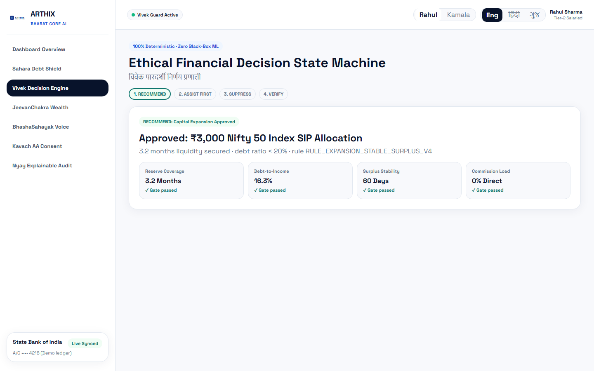
</p>

<p align="center"><sub>Rahul · every gate passed · Direct Nifty 50 SIP recommended</sub></p>

<p align="center">
  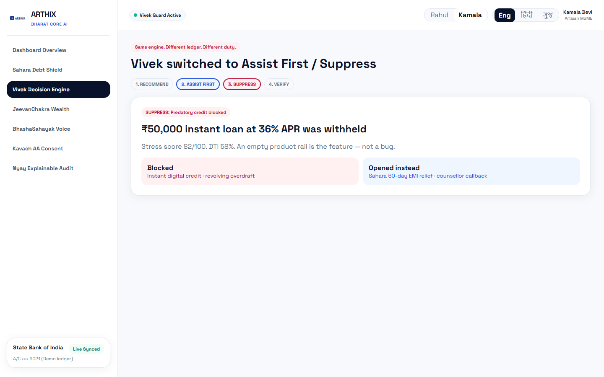
</p>

<p align="center"><sub>Kamala · same engine · Assist First / Suppress · no aggressive credit</sub></p>

---

## Seven modules. One decision spine.

Vivek is the spine. ArthBodh and JeevanChakra feed it. BhashaSahayak, Sahara, and Kavach are channels and protections. Nyay binds every output.

| # | Module | Role | What it actually does in this MVP |
| --- | --- | --- | --- |
| 1 | **ArthBodh** | Customer intelligence | Builds a financial profile from the consented sample ledger: income cadence, spending mix, EMI load, savings residual, surplus trend, DTI. |
| 2 | **JeevanChakra** | Hyper-personalization | Converts profile + life-stage signals into ranked **candidates**. Does not make the final decision. |
| 3 | **Vivek** | Responsible recommendation | Recommend / Assist First / Suppress / Verify. |
| 4 | **BhashaSahayak** | Conversational Bharat banking | Hindi · Gujarati · English. Intent recognition + grounded tools. Does not invent balances or reason codes. |
| 5 | **Sahara** | Financial wellness | Stress score 0–100. Bands Low / Medium / High. High stress triggers assistance and blocks aggressive credit. |
| 6 | **Kavach** | Fraud & anomaly | Rule-based anomaly checks + customer confirmation. Prototype detection — not a bank fraud platform. |
| 7 | **Nyay** | Responsible AI | Purpose-level consent, reason codes, stress/leverage guards, explainability, customer controls, audit logs. |

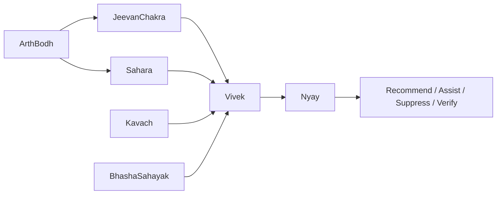
```mermaid
flowchart LR
  AB[ArthBodh]
  JC[JeevanChakra]
  SA[Sahara]
  KV[Kavach]
  BS[BhashaSahayak]
  VV[Vivek]
  NY[Nyay]
  OUT[Recommend / Assist / Suppress / Verify]

  AB --> JC
  AB --> SA
  JC --> VV
  SA --> VV
  KV --> VV
  BS --> VV
  VV --> NY --> OUT
```

---

## Designed around real Bharat

Rural does not mean “cannot learn.” Salaried does not mean “wants every card.” Stress is not moral failure.

The report personas are implemented as seeded demo ledgers.

### Meena Patel — vernacular first-time digital user

**Profile.** Rural household, Gujarati preferred, first-time digital, newly navigating KYC.

**Problem.** English-first banking experiences. Words such as “nomination” and long forms cause drop-off.

**ARTHIX.** Gujarati assistance and a plain-language KYC checklist. Vivek holds product offers until the journey is complete.

**Outcome.** Journey completion without irrelevant product selling.

Seeded as `meena` · locale `gu` · used in BhashaSahayak tests (`KYC ma shu joie?`).

### Rahul — salaried Tier-2 customer

**Profile.** Report persona: Rahul Deshmukh, Nashik, salary step-up. Demo ledger name: **Rahul Sharma**. IT-services salary, existing EMI, digitally confident, offer-fatigued.

**Signal.** `INCOME_STEP_UP` + `SURPLUS_STABLE`. Emergency runway at 3.2 months. DTI well below 35%.

**ARTHIX.** Identifies a suitable Direct Nifty 50 Index SIP and explains why — surplus, buffer, leverage, and zero-commission fit.

**Outcome.** A product that matches a real life-stage, not a spray of twelve offers.

Seeded as `rahul` · one-click login in `/login`.

### Kamala Devi — financially stressed customer

**Profile.** Artisan MSME, Hindi preferred, active EMIs consuming a critical share of inflow, delayed receivables.

**Signals.** High EMI load, negative surplus, unusual late-night UPI debit.

**ARTHIX.** Suppresses aggressive credit. Switches to **Assist First**. Sahara offers 60-day EMI relief guidance. Kavach asks her to confirm the unusual transfer.

**Outcome.** Dignity and a path. The bank practices early care instead of only collections.

Seeded as `kamala` · one-click login in `/login`.

---

## The same engine, three outcomes

| Customer | Situation | Vivek decision | Result |
| --- | --- | --- | --- |
| **Meena** | Needs KYC help | Assist First | Gujarati guidance. No product dump. |
| **Rahul** | Stable surplus + suitable need | Recommend | Relevant SIP, with “Why this?” |
| **Kamala** | High financial stress | Suppress / Assist First | No aggressive credit. Relief first. |

That is the product: hyper-personalization with the discipline to stop.

<p align="center">
  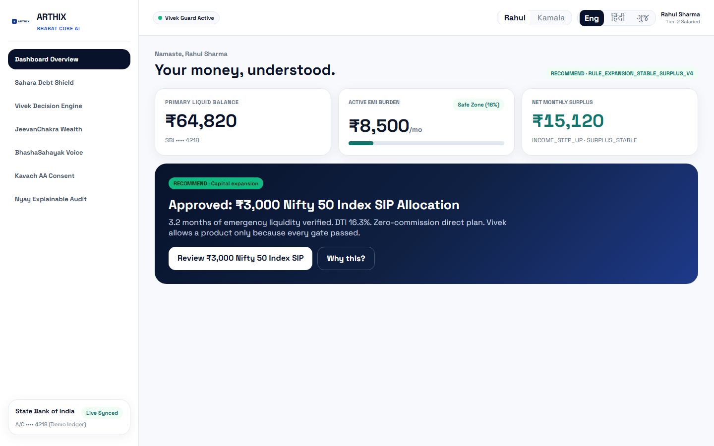
  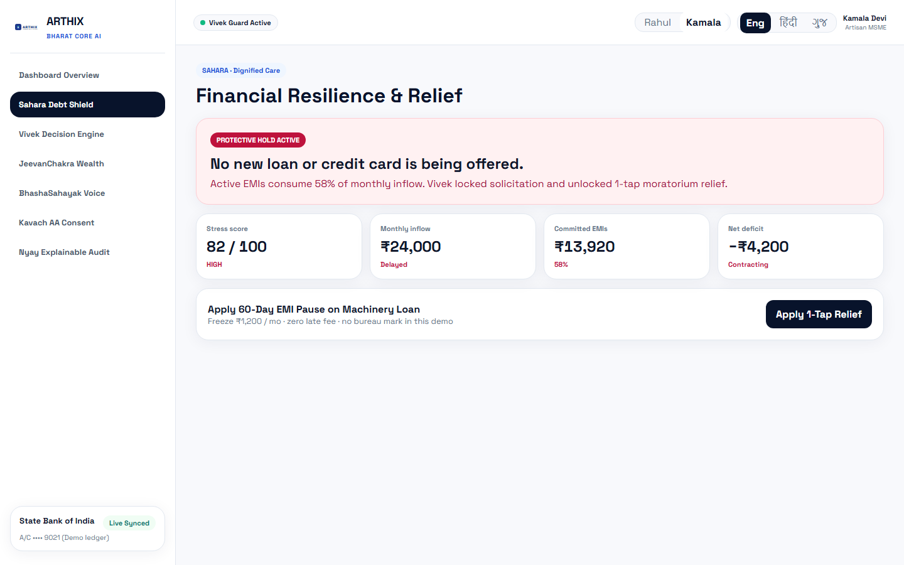
</p>

<p align="center"><sub>Left: Rahul is offered a suitable SIP. Right: Kamala is offered relief, not credit.</sub></p>

---

## Sometimes the best recommendation is nothing

An empty recommendations screen is **not an error**.

It can mean:

- no genuine need
- insufficient eligibility
- unsuitable product
- high financial stress
- excessive leverage
- missing or revoked consent

This is a first-class ARTHIX state. Vivek is allowed to return nothing. Nyay will explain why.

---

## Why this is different

| Traditional banking | ARTHIX |
| --- | --- |
| Generic campaigns | Financial-context intelligence |
| Product-first | Wellbeing-first |
| English-heavy | Hindi + Gujarati + English |
| Sell whenever eligible | Sell only when suitable |
| Stress → collections | Stress → assistance |
| Fraud → silent action | Fraud → customer verification |
| Black-box recommendation | Explainable rule codes |
| Ethics in a policy PDF | Ethics in a runtime gate |
| Always shows products | Can intentionally show nothing |

---

## Customer journey

Onboarding and consent come **before** intelligence. Feedback updates the profile. The same loop serves all three personas.

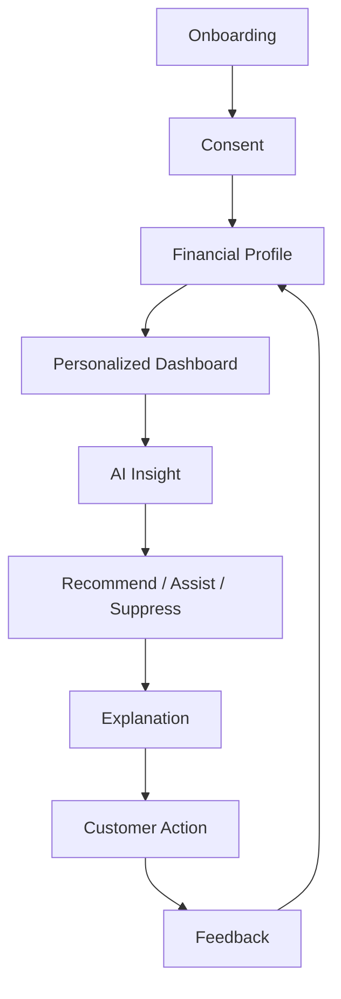
```mermaid
flowchart TB
  O[Onboarding]
  C[Consent]
  F[Financial Profile]
  D[Personalized Dashboard]
  I[AI Insight]
  R[Recommend / Assist / Suppress]
  E[Explanation]
  A[Customer Action]
  L[Feedback]
  O --> C --> F --> D --> I --> R --> E --> A --> L --> F
```

Implemented screens:

| Journey step | Route / surface |
| --- | --- |
| Landing | [`/`](app/page.tsx) |
| Onboarding + language | [`/onboarding`](app/onboarding/page.tsx) |
| Login as persona | [`/login`](app/login/page.tsx) |
| Consent | [`/consent`](app/consent/page.tsx) |
| Dashboard | [`/app`](app/app/page.tsx) → Dashboard |
| Financial health | `/app` → Sahara |
| Recommendations | `/app` → Vivek / JeevanChakra |
| Why this? | `/app` → Nyay |
| Assistant | `/app` → BhashaSahayak |
| Fraud + controls | `/app` → Kavach |

OTP, DigiLocker, and Google tabs on `/login` are **demo adapters**. They map back to the same persona login.

---

## Hyper-personalization pipeline

Need, eligibility, and suitability produce a **candidate**. They are not enough to show it.

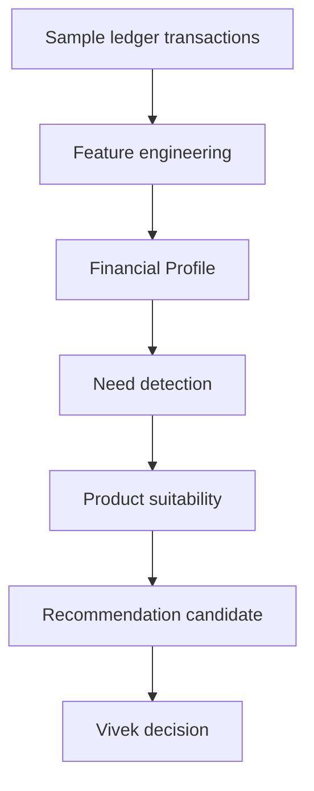
```mermaid
flowchart TB
  TX[Sample ledger transactions]
  FE[Feature engineering]
  CFP[Financial Profile]
  ND[Need detection]
  PS[Product suitability]
  RC[Recommendation candidate]
  VV[Vivek decision]

  TX --> FE --> CFP --> ND --> PS --> RC --> VV
```

JeevanChakra ranks catalogue products with the report’s prototype score:

```text
composite = 0.35·need + 0.25·suitability + 0.20·eligibility + 0.20·timing
```

Vivek may discard the entire ranked list.

---

## AI that knows when not to sell

Deep learning is **not** used for scoring. Methods were chosen for explainability and fitness to a thin, consented ledger.

### What the MVP actually runs

| Capability | Report design | Implemented now |
| --- | --- | --- |
| Behavioral profiling | Rolling 30 / 90 / 180 day windows | Deterministic feature jobs on the **sample ledger** in `arthbodh.ts` |
| Segmentation | K-Means on scaled profile vectors | Rule-derived labels: `SALARIED_SURPLUS`, `CASHFLOW_TIGHT`, `FIRST_DIGITAL`, `BUFFER_BUILDING` |
| Life-stage detection | Rule-based signals | `INCOME_STEP_UP`, `SURPLUS_STABLE`, `NEW_CREDIT_LOAD`, `MISSED_EMI`, `SURPLUS_DECLINE` |
| Recommendation ranking | Hybrid utility ranker | Exact 35 / 25 / 20 / 20 composite in `jeevanchakra.ts` |
| Financial stress | Rules + trend | Sahara score 0–100, bands Low / Medium / High |
| Fraud | Isolation Forest + rules | **Rule-based anomaly** + seeded unusual flags. Isolation Forest is a planned production method. |
| Conversational AI | LLM + constrained tools | Intent classifier + **grounded templates**. LLM API is a planned extension. |
| Vivek | Deterministic gates | Implemented. No neural net. |

K-Means, Isolation Forest, and an LLM API are part of the **reported production-oriented AI architecture**. They are **not shipped as trained models** in this repository. The MVP uses the report’s allowed fallback: rules, pre-scored unusual tags, and scripted grounded replies.

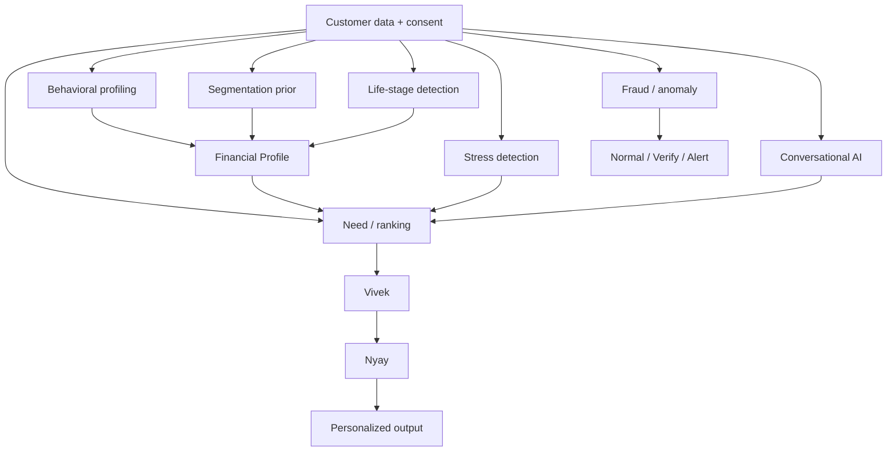
```mermaid
flowchart TB
  CD[Customer data + consent]
  CD --> BP[Behavioral profiling]
  CD --> SEG[Segmentation prior]
  CD --> LS[Life-stage detection]
  CD --> REC[Need / ranking]
  CD --> ST[Stress detection]
  CD --> FR[Fraud / anomaly]
  CD --> CA[Conversational AI]
  BP --> PROF[Financial Profile]
  SEG --> PROF
  LS --> PROF
  PROF --> REC
  ST --> REC
  FR --> AL[Normal / Verify / Alert]
  CA --> REC
  REC --> V[Vivek]
  V --> N[Nyay]
  N --> OUT[Personalized output]
```

### Behavioral profiling — ArthBodh

From consented transactions:

- monthly inflows and income cadence
- salary regularity
- spending mix (essential / discretionary / EMI / other)
- EMI load and DTI
- savings residual and surplus trend
- emergency runway in months

### Segmentation

Segment labels are a **prior / signal**, never an automatic selling decision.

### Life-stage detection

Sparse, auditable rules. A salary step-up does not automatically become a loan.

### Financial stress — Sahara

Score **0–100**.

| Band | Range | System response |
| --- | --- | --- |
| Low | 0–35 | Insight on dashboard |
| Medium | 36–65 | Guidance |
| High | 66–100 | Assistance + suppress aggressive credit |

Deterministic factors:

1. Missed EMI
2. EMI due vs paid / DTI burden
3. Bounce / mandate return
4. Surplus trend
5. Essential-spend compression
6. Cash-out spike

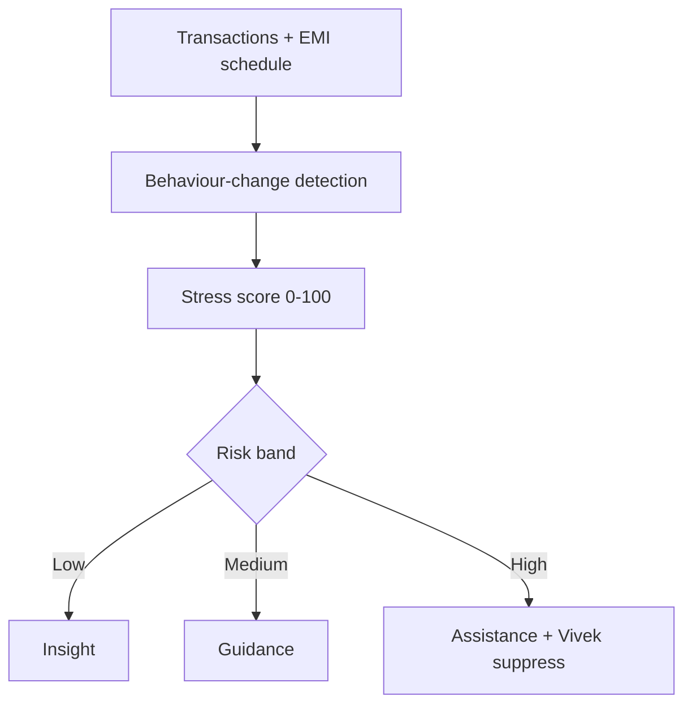
```mermaid
flowchart TB
  TX[Transactions + EMI schedule]
  BC[Behaviour-change detection]
  SS[Stress score 0-100]
  RL{Risk band}
  TX --> BC --> SS --> RL
  RL -->|Low| I[Insight]
  RL -->|Medium| G[Guidance]
  RL -->|High| H[Assistance + Vivek suppress]
```

### Fraud — Kavach

MVP signals in `kavach.ts`:

- new payee
- unusual amount vs median / balance
- unusual hour (23:00–05:00)
- transaction velocity in a 15-minute window

Output: **NORMAL / VERIFY / ALERT**. The account is **never auto-frozen**.

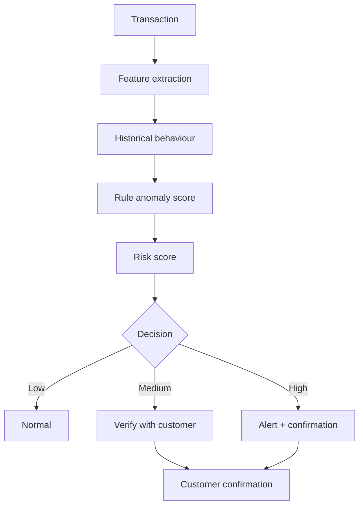
```mermaid
flowchart TB
  T[Transaction]
  FX[Feature extraction]
  HB[Historical behaviour]
  AM[Rule anomaly score]
  RS[Risk score]
  D{Decision}
  T --> FX --> HB --> AM --> RS --> D
  D -->|Low| N[Normal]
  D -->|Medium| V[Verify with customer]
  D -->|High| AL[Alert + confirmation]
  V --> CC[Customer confirmation]
  AL --> CC
```

This is prototype anomaly detection on a sample ledger. It is **not** a complete banking fraud platform.

---

## System architecture

**MVP runtime — what this repository runs.**

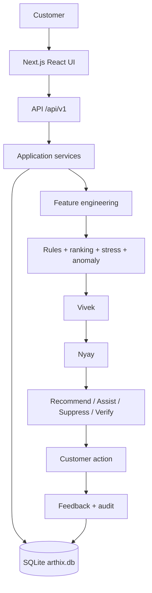
```mermaid
flowchart TB
  C[Customer]
  UI[Next.js React UI]
  API[API /api/v1]
  APP[Application services]
  DB[(SQLite arthix.db)]
  FE[Feature engineering]
  AI[Rules + ranking + stress + anomaly]
  V[Vivek]
  N[Nyay]
  OUT[Recommend / Assist / Suppress / Verify]
  ACT[Customer action]
  FB[Feedback + audit]

  C --> UI --> API --> APP
  APP --> DB
  APP --> FE --> AI --> V --> N --> OUT --> ACT --> FB
  FB --> DB
```

Two API hosts exist. They expose the **same `/api/v1` contract**:

| Host | How to start | Use |
| --- | --- | --- |
| **Next.js App Router** | `npm run dev` → `http://localhost:3000` | Primary demo path. UI calls these routes. |
| **Express** | `npm run server` → `http://localhost:5000` | Optional standalone intelligence server. |

Data sources in the MVP are **mocked**: seed SQL ledgers, a product catalogue, and consent records. There is no live CBS, UPI, CKYC, or bureau adapter.

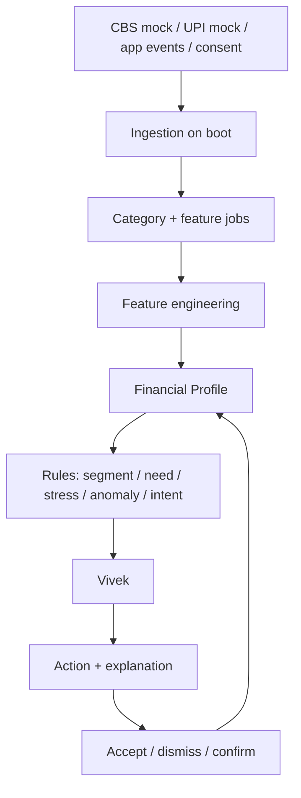
```mermaid
flowchart TB
  DS[CBS mock / UPI mock / app events / consent]
  IN[Ingestion on boot]
  PR[Category + feature jobs]
  FE[Feature engineering]
  CP[Financial Profile]
  MD[Rules: segment / need / stress / anomaly / intent]
  DE[Vivek]
  PA[Action + explanation]
  FB[Accept / dismiss / confirm]
  DS --> IN --> PR --> FE --> CP --> MD --> DE --> PA --> FB
  FB --> CP
```

### Production extension — not MVP

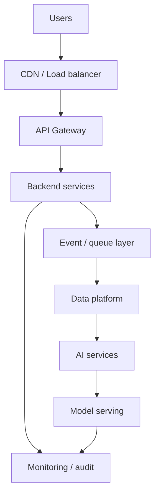
```mermaid
flowchart TB
  US[Users]
  CDN[CDN / Load balancer]
  AG[API Gateway]
  BE[Backend services]
  Q[Event / queue layer]
  DP[Data platform]
  AIS[AI services]
  MS[Model serving]
  MON[Monitoring / audit]
  US --> CDN --> AG --> BE --> Q --> DP --> AIS --> MS
  BE --> MON
  MS --> MON
```

The decision contract stays the same: profile in, Vivek action and reasons out. Mocks become adapters.

---

## Conversational AI — BhashaSahayak

Chat is a **surface**, not the product. It executes the same Vivek decision the dashboard shows.

Text only in the MVP: **Hindi · Gujarati · English**. Voice is a future extension.

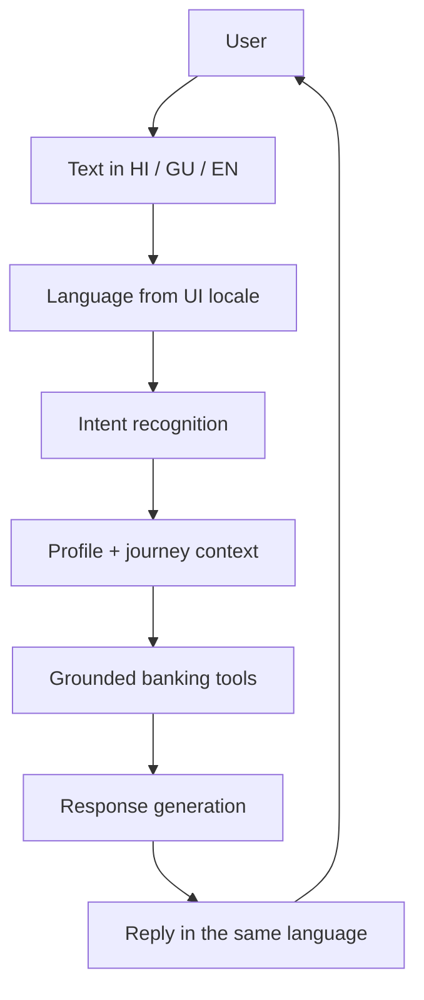
```mermaid
flowchart TB
  U[User]
  TX[Text in HI / GU / EN]
  LD[Language from UI locale]
  IR[Intent recognition]
  CX[Profile + journey context]
  TL[Grounded banking tools]
  RG[Response generation]
  OUT[Reply in the same language]
  U --> TX --> LD --> IR --> CX --> TL --> RG --> OUT --> U
```

Implemented intents:

| Intent | Example |
| --- | --- |
| `KYC_HELP` | `KYC ma shu joie?` |
| `PROFILE_HELP` | What is my balance? |
| `RECOMMENDATION_EXPLANATION` | Why did you recommend this? |
| `WELLNESS_HELP` | I am struggling with EMI |
| `FRAUD_HELP` | Did I send money to an unknown VPA? |
| `GENERAL` | Greeting + capability menu |

Grounded tools include `get_profile`, `get_accounts`, `evaluate_vivek_decision`, `get_nyay_reasons`, `get_sahara_wellness`, and Kavach fraud/alert lookups.

**Hard rule:** the assistant may explain stored reasons. It must **not** invent financial balances, reason codes, eligibility, or unsupported bank actions.

KYC in chat is **guidance** (checklist, plain-language steps). It does not replace CKYC or live video KYC.

---

## Responsible AI is a runtime decision

Nyay is not a policy appendix. It is a runtime guardrail in `lib/services/nyay.ts`.

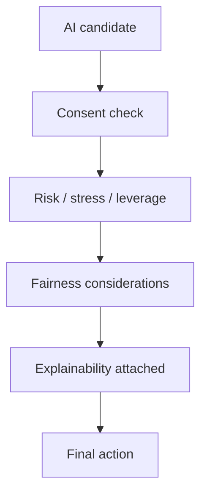
```mermaid
flowchart TB
  AD[AI candidate]
  C[Consent check]
  R[Risk / stress / leverage]
  B[Fairness considerations]
  E[Explainability attached]
  F[Final action]
  AD --> C --> R --> B --> E --> F
```

Nyay enforces:

- purpose-level consent — transaction analysis ≠ personalization ≠ model improvement ≠ chat history
- data minimization and masked account numbers
- reason codes in English, Hindi, and Gujarati
- stress suppression and over-leverage protection
- no countdown, no “last chance” credit nudges
- human-escalation path (counsellor callback in Sahara)
- append-only `audit_logs`
- customer ability to revoke consent and pause personalization
- recommendation feedback and contestability

> Personalization that cannot say no is just aggressive selling.

---

<a id="product-interface"></a>

## Product interface

Literacy-first UX, implemented across landing, onboarding, consent, and the `/app` workstation:

- large typography and one primary action
- persistent language toggle: English / Hindi / Gujarati
- plain language, rupee amounts, no deep navigation maze
- empty-state recommendations as a feature
- “Why this?” as a first-class Nyay screen
- visible consent controls

Frames below match the implemented screens, copy, and design tokens in `app/` and `components/web/`.

### Enter as a persona

<p align="center">
  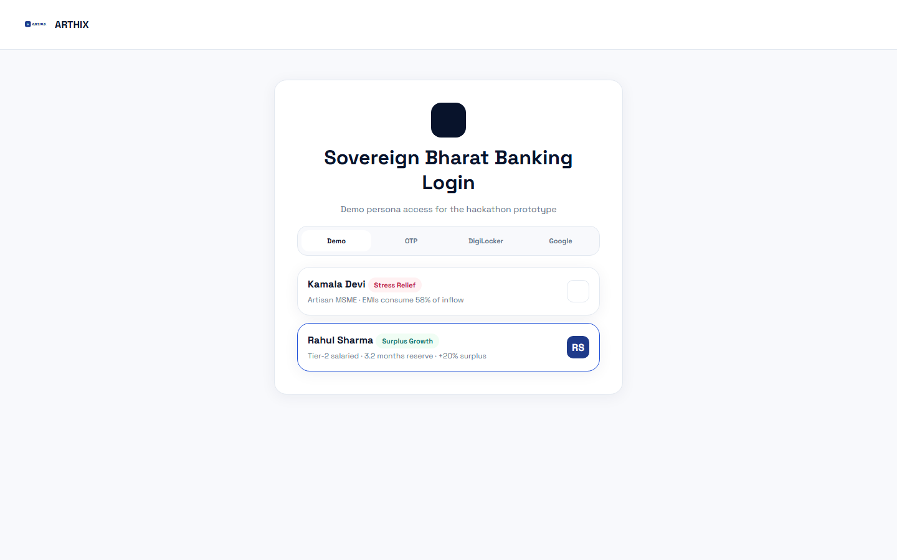
</p>

<p align="center"><sub>`/login` · one-click demo personas. OTP, DigiLocker, and Google tabs are mocked adapters.</sub></p>

### Language first, then permission

<p align="center">
  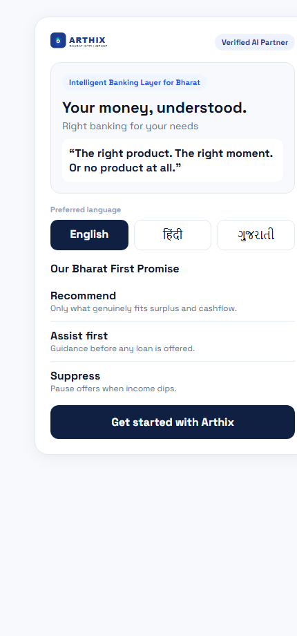
  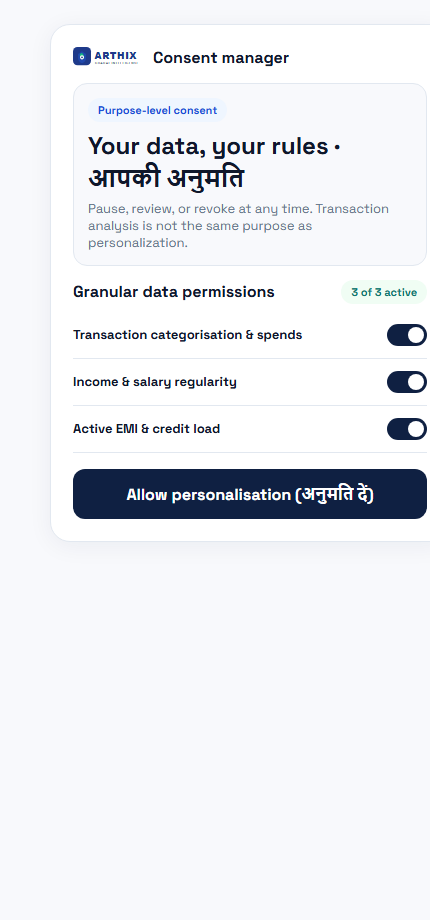
</p>

<p align="center"><sub>`/onboarding` and `/consent` · Hindi / Gujarati / English · purpose-level grant or skip</sub></p>

### Dashboard — your money, understood

<p align="center">
  
</p>

<p align="center"><sub>`/app` · Rahul · surplus, EMI safety zone, and Vivek’s recommend banner</sub></p>

### Recommendations and “Why this?”

<p align="center">
  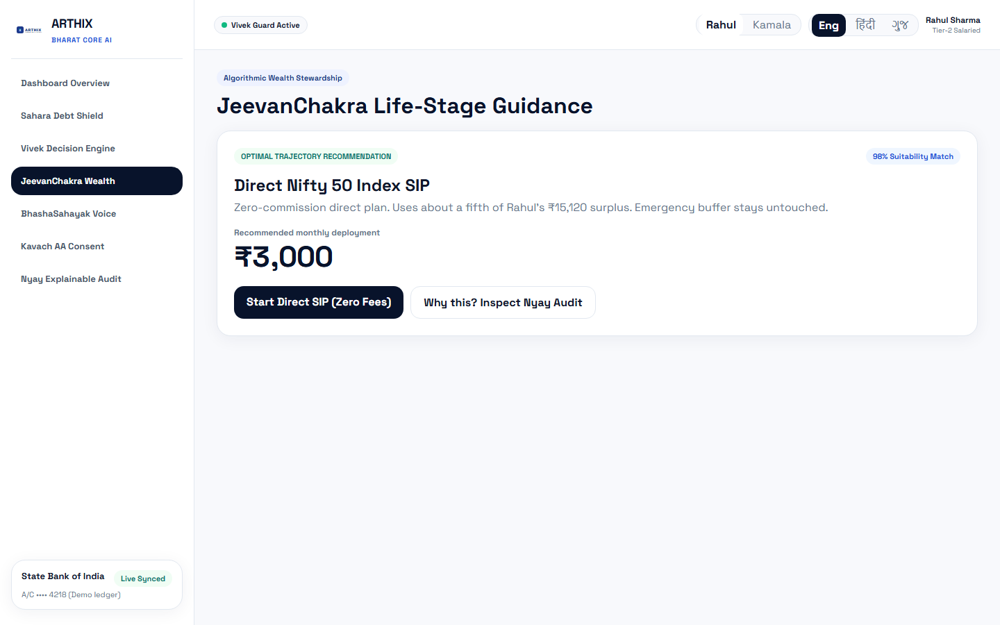
  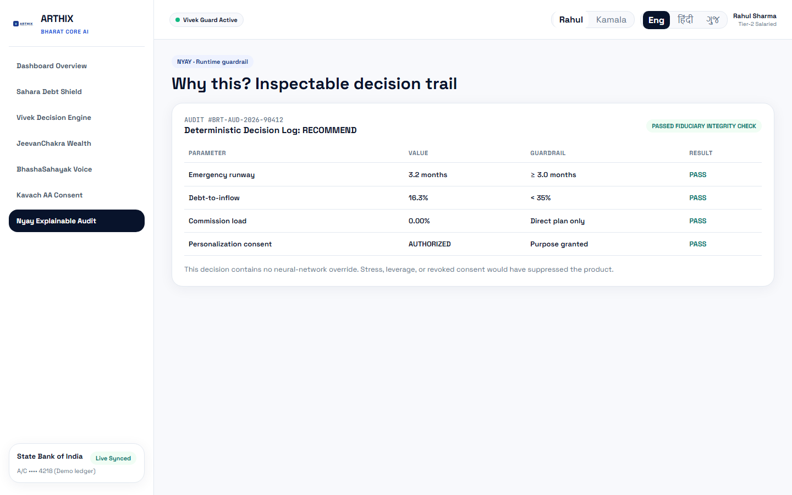
</p>

<p align="center"><sub>JeevanChakra ranks a candidate. Nyay shows the math a customer can contest.</sub></p>

### Stress, fraud, and vernacular help

<p align="center">
  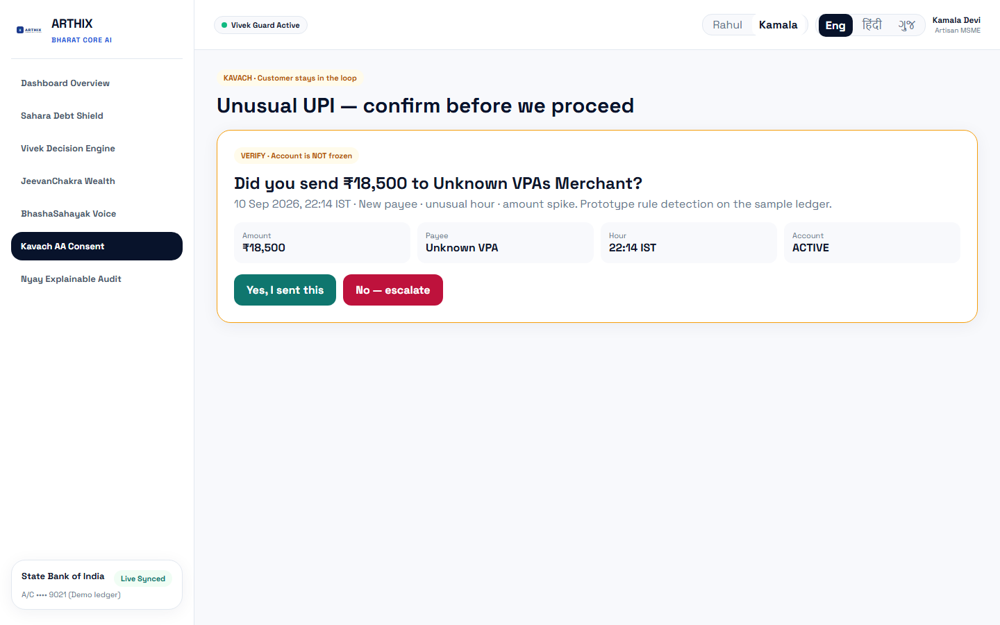
  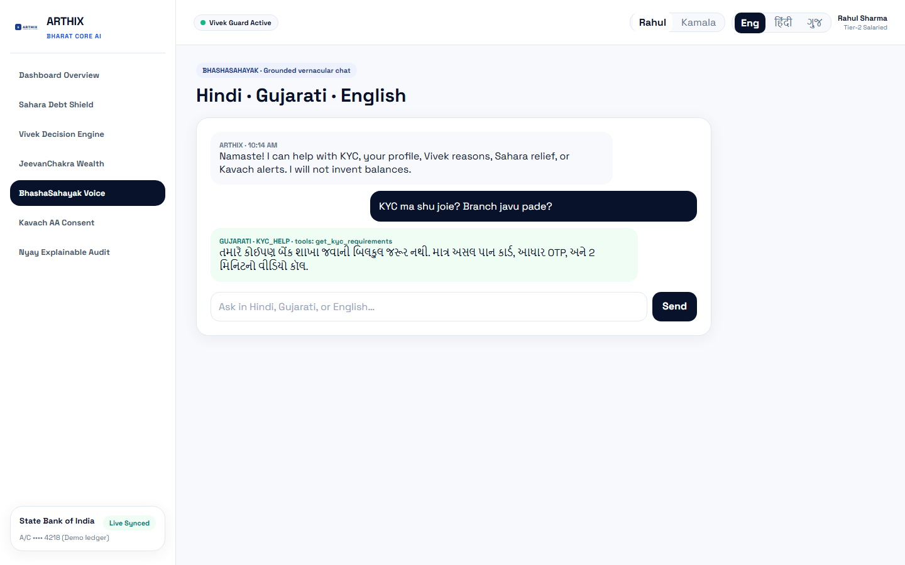
</p>

<p align="center"><sub>Kavach asks before it acts. BhashaSahayak answers `KYC ma shu joie?` from grounded tools.</sub></p>

| Screen | Route | Purpose |
| --- | --- | --- |
| Landing | [`/`](app/page.tsx) | Philosophy and three-outcome story |
| Onboarding | [`/onboarding`](app/onboarding/page.tsx) | Language + Recommend / Assist / Suppress promise |
| Login | [`/login`](app/login/page.tsx) | Demo personas Rahul and Kamala |
| Consent | [`/consent`](app/consent/page.tsx) | Purpose-level grant / revoke |
| Dashboard | [`/app`](app/app/page.tsx) | Balance, surplus, Vivek signal |
| Sahara | `/app` → Sahara | Stress, cash-flow audit, 1-tap relief |
| Vivek | `/app` → Vivek | Live decision + mathematical rationale |
| JeevanChakra | `/app` → JeevanChakra | Candidate product + Why this? |
| BhashaSahayak | `/app` → BhashaSahayak | Vernacular grounded chat |
| Kavach | `/app` → Kavach | Consent streams + fraud confirmation |
| Nyay | `/app` → Nyay | Inspectable audit trail |

Regenerate the gallery after UI changes:

```bash
node docs/_capture/capture.mjs
```

---

## Security and privacy

### MVP — what is implemented

| Control | Implementation |
| --- | --- |
| Authentication | Demo persona login. Token is a local session string (`token-…` / `jwt-session-…`), stored in `localStorage`. |
| Authorization | Routes key off the selected persona. Users see that persona’s seeded ledger. |
| Data display | Masked account numbers (`•••• 4218`). |
| Secrets | No committed `.env`. Express reads optional `PORT`. |
| Audit | `audit_logs` for login, consent, chat, relief, fraud confirm, feedback. |
| Fraud response | Customer confirmation. No silent freeze. |
| Identity documents | **No full PAN or Aadhaar stored** in the database. |

OTP, DigiLocker, and Google sign-in are UI demonstrations of future bank identity paths. They do not call live identity providers.

### Production direction — not MVP

Bank identity provider · 2FA · device binding · WAF · rate limiting · mTLS · TLS 1.2+ · field encryption · HSM · vault / secret rotation · SIEM · tokenization · immutable audit store.

Hackathon security is **demo hygiene**. Formal information-security audit is not claimed.

### Data privacy

- consented transaction analysis only
- purpose limitation with separate toggles
- data minimization — features over raw statement dumps
- masked identifiers
- no full PAN / Aadhaar in the MVP
- model-improvement purpose defaults to **revoked**
- customer can revoke cashflow / personalization consent

> ARTHIX is a hackathon prototype. It does not claim RBI compliance or DPDP certification. Production deployment would require formal legal, regulatory, security, privacy, and model-risk validation.

---

## API

Base path: **`/api/v1`**.

Hackathon authentication is a demo session token. Personalization respects Nyay consent state. Query or body field `persona` selects `rahul` | `kamala` | `meena`.

| Method | Endpoint | Purpose |
| --- | --- | --- |
| `POST` | `/auth/login` | Sign in as a persona → `{ token, user }` |
| `GET` | `/me` | Current user + locale |
| `GET` | `/me/profile` | ArthBodh financial profile + signals |
| `GET` | `/me/transactions` | Masked sample ledger |
| `POST` | `/intelligence/refresh` | Recompute features and Vivek decision |
| `GET` | `/recommendations` | Nyay-gated Vivek decision + JeevanChakra candidates |
| `GET` | `/recommendations/:id/why` | Explanation / audit record |
| `POST` | `/recommendations/:id/feedback` | Accept or dismiss |
| `POST` | `/chat` | BhashaSahayak turn `{ text, locale, sessionId }` |
| `GET` | `/wellness` | Sahara stress band and relief actions |
| `POST` | `/wellness/relief` | Apply demo EMI-relief action |
| `GET` | `/alerts` | Open alerts |
| `POST` | `/fraud/:eventId/confirm` | Customer verify `{ recognized }` |
| `GET` | `/consent` | Purpose records |
| `PUT` | `/consent` | Authorize or revoke a purpose |
| `GET` | `/audit/me` | Customer-visible decision log |

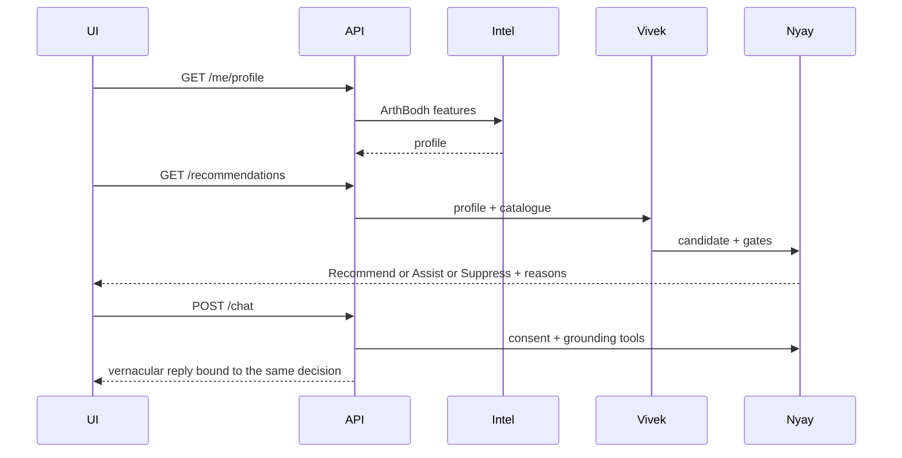
```mermaid
sequenceDiagram
  participant UI
  participant API
  participant Intel
  participant Vivek
  participant Nyay
  UI->>API: GET /me/profile
  API->>Intel: ArthBodh features
  Intel-->>API: profile
  UI->>API: GET /recommendations
  API->>Vivek: profile + catalogue
  Vivek->>Nyay: candidate + gates
  Nyay-->>UI: Recommend or Assist or Suppress + reasons
  UI->>API: POST /chat
  API->>Nyay: consent + grounding tools
  API-->>UI: vernacular reply bound to the same decision
```

---

## Database

SQLite file `arthix.db` is created on first import of [`lib/db.ts`](lib/db.ts). Schema and three persona ledgers are seeded automatically.

Implemented entities:

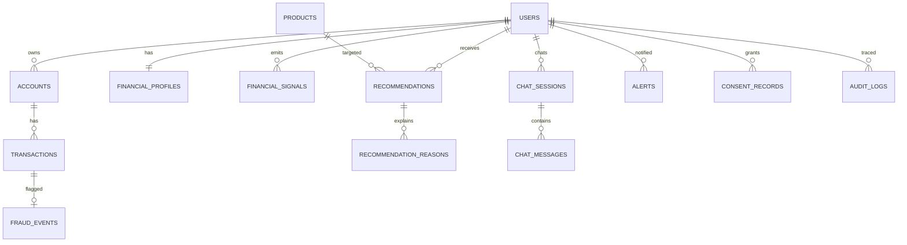
```mermaid
erDiagram
  USERS ||--o{ ACCOUNTS : owns
  ACCOUNTS ||--o{ TRANSACTIONS : has
  USERS ||--|| FINANCIAL_PROFILES : has
  USERS ||--o{ FINANCIAL_SIGNALS : emits
  USERS ||--o{ RECOMMENDATIONS : receives
  PRODUCTS ||--o{ RECOMMENDATIONS : targeted
  RECOMMENDATIONS ||--o{ RECOMMENDATION_REASONS : explains
  USERS ||--o{ CHAT_SESSIONS : chats
  CHAT_SESSIONS ||--o{ CHAT_MESSAGES : contains
  USERS ||--o{ ALERTS : notified
  TRANSACTIONS ||--o| FRAUD_EVENTS : flagged
  USERS ||--o{ CONSENT_RECORDS : grants
  USERS ||--o{ AUDIT_LOGS : traced
```

| Entity | Purpose |
| --- | --- |
| `users` | Persona identity, locale, income band, digital maturity |
| `accounts` | Bank shell with **masked** account number + balance |
| `transactions` | Sample ledger: amount, type, category, channel, `is_unusual` |
| `financial_profiles` | Income, essentials, EMI, surplus, runway, stress, segment |
| `financial_signals` | Life-stage events + evidence |
| `products` | Catalogue: SIP, gold bond, reserve top-up, EMI relief |
| `recommendations` | Issued action enum: `RECOMMEND` / `ASSIST_FIRST` / `SUPPRESS` / `VERIFY` |
| `recommendation_reasons` | Rule code + EN / HI / GU text |
| `consent_records` | Purpose, institution, status, expiry |
| `alerts` | Stress / fraud / insight |
| `fraud_events` | Score, decision, customer response |
| `chat_sessions` / `chat_messages` | Assistant history + tool trace |
| `audit_logs` | Actor, action, rule, metadata |

The report also describes `stress_indicators`. That table is **not** created in this MVP. Sahara computes stress factors in memory and persists the resulting score on `financial_profiles`.

Vivek decisions are **computed live** on each request. A missed-EMI / high-stress ledger flips the engine from Recommend to Assist First. The decision is not hardcoded to a persona name.

---

## MVP implementation

What the prototype actually does, on sample ledgers.

| Capability | Status |
| --- | --- |
| Onboarding, consent, dashboard, health, recommendations, why-this, chat, stress, fraud, controls | Implemented |
| `/api/v1` contract | Implemented in Next.js and Express |
| Three persona ledgers | Seeded sample data |
| Feature jobs and life-stage signals | Implemented on sample data |
| Vivek gates and reason codes | Implemented |
| Vernacular chat with grounded tools | Implemented via intent + templates |
| Isolation Forest / sklearn / LLM API | **Not present.** Rules + scripted fallback. |
| CBS / UPI / CKYC / bureau / SMS | Mocked |
| Voice / video KYC | Not in MVP |
| Compliance certification | Not claimed |

---

## Tech stack

Generated from this repository — not from a wish list.

| Layer | Actual MVP |
| --- | --- |
| **Frontend** | Next.js 14, React 18, TypeScript, Tailwind CSS, Lucide icons |
| **Backend** | Next.js Route Handlers + optional Express 5 |
| **Database** | SQLite via `better-sqlite3` |
| **AI / ML** | Deterministic rules, composite ranking, Sahara stress, Kavach anomaly rules, intent classification |
| **Authentication** | Demo persona session token |
| **Internationalization** | `lib/i18n.ts` + per-screen EN / HI / GU copy |
| **Infrastructure** | Local Next.js / Express. No Docker in this repo. |
| **Testing** | `tsx` suites in `tests/` |
| **Tooling** | ESLint, PostCSS, TypeScript |

The product report mentions React + Vite, PostgreSQL, scikit-learn, Isolation Forest, K-Means, and an LLM API as the intended / production-oriented stack. **Those are not the runtime of this repository**, except where the same ideas are expressed as rules.

---

## 5-minute ARTHIX demo

Run `npm run dev` and open [http://localhost:3000](http://localhost:3000).

| Step | What to do | What to look for |
| --- | --- | --- |
| 1 | Open `/login` → **Rahul** | Salaried surplus persona. |
| 2 | Review `/consent` | Purpose-level permissions. Grant personalization. |
| 3 | Land in `/app` Dashboard | Balance, surplus, Vivek signal. |
| 4 | Open **Vivek** | **RECOMMEND** — Direct Nifty 50 SIP. Rule `RULE_EXPANSION_STABLE_SURPLUS_V4`. |
| 5 | Open **JeevanChakra** | Candidate ranking and recommended amount. |
| 6 | Click **Why this?** / open **Nyay** | Inspectable math: runway ≥ 3 months, DTI &lt; 35%, zero commission. |
| 7 | Switch persona to **Kamala** | Same engine, different ledger. |
| 8 | Open **Sahara** then **Vivek** | Stress band High. **ASSIST FIRST**. Aggressive credit suppressed. |
| 9 | Open **Kavach** | Unusual UPI to “Unknown VPAs Merchant”. |
| 10 | Confirm or dispute the transfer | `POST /fraud/fe-k4/confirm`. Account stays unfrozen. |
| 11 | Open **BhashaSahayak** | Ask in Hindi or Gujarati: *Why this?* / EMI help / *KYC ma shu joie?* |

<p align="center">
  
  
</p>

<p align="center"><sub>Demo beats: show a suitable SIP, then switch to Kamala and verify the unusual UPI.</sub></p>

To see Meena’s KYC-assist path, send `persona: "meena"` to `POST /api/v1/chat` with `locale: "gu"` and text `KYC ma shu joie?`.

---

## Quick start

Requires Node.js 18+.

```bash
git clone <this-repository>
cd Arthix-main
npm install
npm run dev
```

Open **http://localhost:3000**.

SQLite initializes itself on first request. There is no separate migration command and no required `.env` for the local demo.

| Script | Command | What it does |
| --- | --- | --- |
| Dev UI + APIs | `npm run dev` | Next.js on port 3000 |
| Express API only | `npm run server` | Intelligence server on port 5000 |
| Core tests | `npm test` | ArthBodh, JeevanChakra, Vivek, Sahara, Nyay, Kavach |
| Chat tests | `npx tsx tests/bhashasahayak.test.ts` | Grounded multilingual assistant |
| Production build | `npm run build` && `npm start` | Next.js production server |
| Lint | `npm run lint` | ESLint |

Optional standalone API:

```bash
npm run server
```

Then `http://localhost:5000/api/v1/recommendations?persona=rahul`.

---

## Project structure

```text
Arthix-main/
├── app/
│   ├── page.tsx                 # Landing
│   ├── login/page.tsx           # Demo persona login
│   ├── onboarding/page.tsx      # Language + promise
│   ├── consent/page.tsx         # Purpose-level consent
│   ├── app/page.tsx             # Workstation shell
│   └── api/v1/                  # Next.js REST contract
├── components/
│   ├── web/                     # Desktop module screens
│   ├── Dashboard.tsx            # Mobile-style home
│   ├── VivekDecisions.tsx       # Four-gate explainer
│   ├── Sahayak.tsx              # Mobile chat
│   ├── Sahara.tsx               # Mobile wellness
│   └── JeevanChakra.tsx         # Mobile recommendations
├── lib/
│   ├── db.ts                    # SQLite schema + seed
│   ├── i18n.ts                  # EN / HI / GU strings
│   └── services/
│       ├── arthbodh.ts
│       ├── jeevanchakra.ts
│       ├── vivek.ts
│       ├── sahara.ts
│       ├── kavach.ts
│       ├── bhashasahayak.ts
│       └── nyay.ts
├── server/
│   ├── app.ts                   # Express /api/v1
│   └── index.ts                 # Port 5000
├── tests/                       # Decision + chat suites
├── docs/screenshots/            # README interface gallery
├── docs/_capture/               # Regenerates the gallery frames
├── public/arthix-logo.svg
├── .agents/rules/               # Product constitution
├── package.json
└── LICENSE
```

---

## MVP versus production

| Capability | This MVP | Production extension |
| --- | --- | --- |
| Database | SQLite (`arthix.db`) | Bank data platform |
| Banking integrations | Mock adapters + seed ledger | Live CBS / UPI / CKYC / bureau |
| AI | Rules + ranking + intent templates | Model registry, K-Means, Isolation Forest, grounded LLM, monitoring |
| Fraud | Prototype rule anomaly | Full bank fraud platform |
| Channels | Web prototype | App + RM workstation + contact centre |
| Infrastructure | Local Next.js / Express | CDN / WAF / gateway |
| Monitoring | Console logs + `audit_logs` | SIEM + model monitoring |
| Voice | Not available | Future |
| Video KYC | Guidance only | Future live journey |
| Compliance | Not certified | Formal validation |

---

## Engineering highlights

- **Deterministic decision gates.** Vivek is inspectable. A judge or ombudsman can replay why a product was shown or withheld.
- **Explainability is stored, not improvised.** Rule codes and EN / HI / GU reasons travel with the decision.
- **Consent-aware intelligence.** Revoked personalization consent suppresses recommendations at runtime.
- **Feature engineering is separated from policy.** ArthBodh computes. JeevanChakra ranks. Vivek decides. Nyay binds.
- **Rule + hybrid architecture.** Ranking is a transparent utility score. Final action is policy, not model confidence.
- **Grounded conversational AI.** The assistant reads tools. It does not author balances.
- **Auditability.** Login, consent changes, chat, relief, fraud confirmation, and feedback write `audit_logs`.
- **Modular services.** Each Sanskrit-named module is a file with a single job.
- **Mock adapter strategy.** OTP, DigiLocker, Google, CBS, and UPI are honest fakes. They are not dressed up as live rails.
- **MVP → production extensibility.** The contract — profile in, Vivek action + reasons out — survives a swap of SQLite for a bank feature store.

---

## Current limitations

Honesty is part of the fiduciary claim.

- Intelligence quality depends on the **sample ledger**, not a live bureau score.
- CBS, UPI, CKYC, bureau, OTP, DigiLocker, and notifications are **mocked**.
- Conversational replies are **template-grounded**. An LLM is not wired; money figures still come from tools.
- Kavach is **prototype anomaly detection**, not a bank fraud platform.
- Isolation Forest, K-Means, and production model serving are **not implemented**.
- Language coverage is Hindi, Gujarati, and English — not all of Bharat.
- Stress scores are deterministic heuristics, not calibrated default probabilities.
- Bias monitors and model-risk governance are not in the MVP.
- Demo authentication is not a bank-grade identity provider.
- **No formal RBI or DPDP attestation.**

---

## Roadmap

These are **not** current capabilities.

### Phase 1 — MVP

This repository. Sample ledgers. Deterministic Vivek. Grounded vernacular chat.

### Phase 2 — Banking integration

Live CBS / UPI / CKYC / notification adapters behind the same interfaces.

### Phase 3 — Intelligence

Feature store. Calibrated stress models. Isolation Forest / production fraud intelligence. Model registry.

### Phase 4 — Bharat expansion

Additional vernacular languages. Voice.

### Phase 5 — Enterprise

Relationship-manager workstation, contact centre, fairness monitors, model-risk governance.

### Phase 6 — Regulatory readiness

Formal privacy, security, regulatory, and model-risk validation.

---

## CTRL FREAKS

ARTHIX is built by **CTRL FREAKS**.

A hackathon team treating personalization as a fiduciary act: understand financial context well enough to know when to recommend, when to assist, and when to say no.

Copyright © 2026 AUM PETHANI · MIT License.

---

## Final philosophy

ARTHIX does not exist to sell more products to more people.

It exists to understand financial context well enough to know:

**when to recommend,**

**when to assist,**

and, importantly,

**when to say no.**

The same engine can recommend a suitable SIP to Rahul, help Meena finish KYC in Gujarati, and refuse to sell a loan to Kamala.

That is the product.

> **The right product. The right moment. Or no product at all.**
